# raspberry_car

### GPIO 连接

| BCM  | wPi  | Name | Mode | 用途 | V    | Phys | ical | 用途  | V    | Mode | Name | wPi  | BCM  |
| ---- | ---- | ---- | ---- | ---- | ---- | ---- | ---- | ---- | ---- | ---- | ---- | ---- | ---- |
| 1 |      | 3.3v |      | **四路循迹高电平**，**超声波高电平** |      | 1    | 2    | **蜂鸣器高电平** |      |      | 5v   |      |      |
| 2    | 8    | SDA.1 | IN   | **陀螺仪加速度传感器数据线** | 1    | 3    | 4    | **陀螺仪高电平** |      |      | 5v   |      |      |
|   3 |   9 |   SCL.1 |   IN | **陀螺仪加速度传感器时钟线** | 1 |  5 | 6  | **蜂鸣器接地端** |   |      | 0v      |     |     |
|   4 |   7 | GPIO. 7 |   IN | **蜂鸣器响应** | 1 |  7 | 8  |  | 1 | IN   | TxD     | 15  | 14  |
|     |     |      0v |      |      |   |  9 | 10 |  | 1 | IN   | RxD     | 16  | 15  |
|  17 |   0 | GPIO. 0 |   IN | **四路寻迹IN4**           | 1 | 11 | 12 | **四路避障IN3** | 0 | OUT  | GPIO. 1 | 1   | 18  |
|  27 |   2 | GPIO. 2 |   IN | **五路避障IN3** **超声波Trig** | 0 | 13 | 14 |   |   |      | 0v      |     |     |
|  22 |   3 | GPIO. 3 |   IN | **L298N左侧后退控制** | 0 | 15 | 16 | **L298N右侧前进控制** | 0 | IN   | GPIO. 4 | 4   | 23  |
|     |     |    3.3v |      |      |   | 17 | 18 | **L298N右侧后退控制** | 0 | IN   | GPIO. 5 | 5   | 24  |
|  10 |  12 |    MOSI | ALT0 |  | 0 | 19 | 20 |   |   |      | 0v      |     |     |
|   9 |  13 |    MISO | ALT0 |  | 0 | 21 | 22 |  | 0 | IN   | GPIO. 6 | 6   | 25  |
|  11 |  14 |    SCLK | ALT0 |  | 0 | 23 | 24 |  | 1 | OUT  | CE0     | 10  | 8   |
|     |     |      0v |      | **四路循迹接地** |   | 25 | 26 |  | 1 | OUT  | CE1     | 11  | 7   |
|   0 |  30 |   SDA.0 |   IN |    | 1 | 27 | 28 |  | 1 | IN   | SCL.0   | 31  | 1   |
|   5 |  21 | GPIO.21 |   IN | **L298N使能** | 1 | 29 | 30 |   |   |      | 0v      |     |     |
|   6 |  22 | GPIO.22 |   IN | **L298N使能** | 1 | 31 | 32 |  | 0 | IN   | GPIO.26 | 26  | 12  |
|  13 |  23 | GPIO.23 |   IN | **L298N使能** | 0 | 33 | 34 |   |   |      | 0v      |     |     |
|  19 |  24 | GPIO.24 |   IN | **L298N使能** | 1 | 35 | 36 | **四路避障IN2** | 0 | IN   | GPIO.27 | 27  | 16  |
|  26 |  25 | GPIO.25 |   IN | **四路寻迹IN1** | 0 | 37 | 38 | **超声波Echo** | 0 | IN   | GPIO.28 | 28  | 20  |
|     |     |      0v |      |      |   | 39 | 40 | **L298N左侧前进控制** | 0 | IN   | GPIO.29 | 29  | 21  |

### 基本实现

>作业二 智能小车比赛
>基于开源硬件树莓派和Linux操作系统（或者不使用操作系统），使用C语言编程，自己动手制作1个能够电池独立供电的智能小车，能够在特定实验场地完整跑完1周。
>场地具有：直角弯道、S弯道、红绿灯、上坡道（不要翻车）。
>作业要求：
>（1）使用C语言，有效连接传感器，不能使用Python等其他语言；
>（2）自己购买素材，可以是两轮、三轮、四轮车。在车体平台上，总体预算为（轮子数量*120，不含树莓派）；
>（3）配备摄像头等传感器，可以采用遥控和黑线寻迹行驶。
>扩展要求：
>（1） 具有超声波避障、红外栅栏等附件传感器的扩展功能；
>（2） 具有自动建图、路基循迹、红绿灯识别等高级功能（可以用Python）；
>（3） 具有其他有创意的功能（可以另外提交预算）。
>提交要求：
>（1）除了提交源代码，还需要提交文档，格式和内容自定，能够充分说明自己的作业即可；
>（2）录制系统运行的过程，进行最充分的功能展示，并使用视频编辑软件（如最容易上手的爱剪辑）进行视频剪辑和配音；
>（3）5月11日之前提交，dahogn@sdu.edu.cn，5月9日演示。

### 开发环境

#### VSCode ssh连接

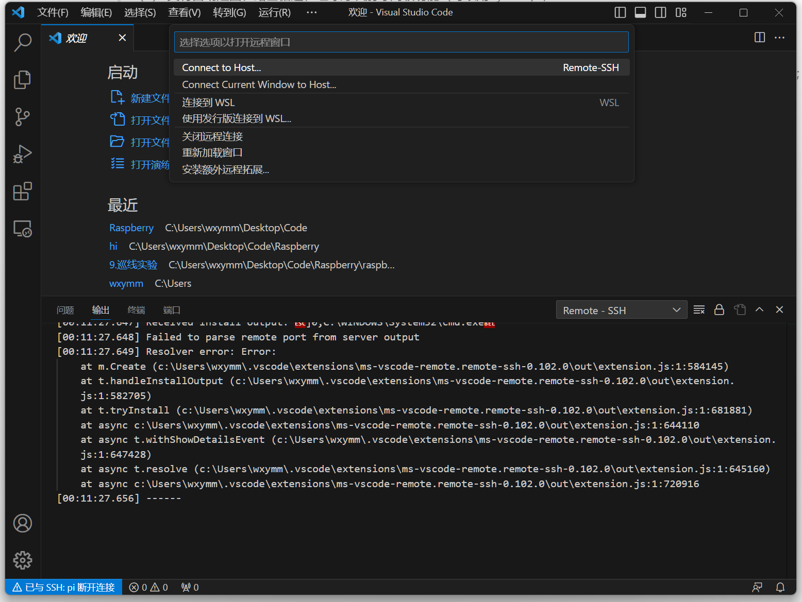

​	直接在vscode上进行代码编写，并且使用vscode的终端进行编译运行。

#### VNC Viewer 连接

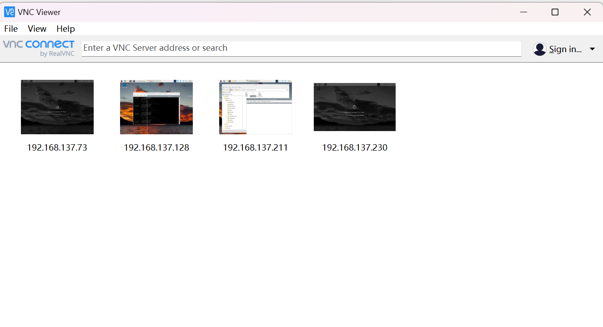

直接连接树莓派的操作界面，直接写入树莓派内部。

#### Xshell连接 

在shell中使用nano与vim编写代码

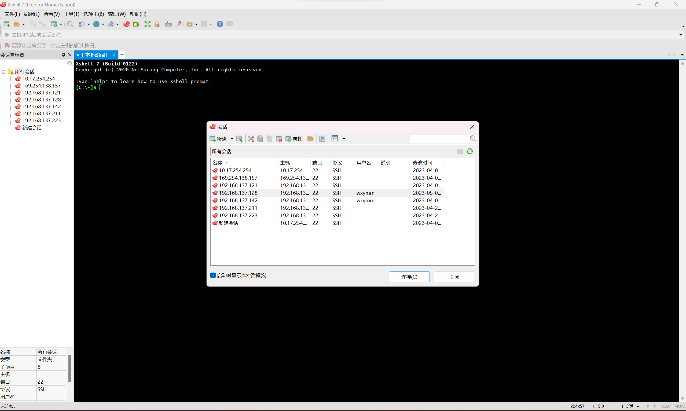

### 已配备元器件：

* L298N 电机控制模块：

  * 实现了对电机的串联，分配电压
  * 并且通过对电机使能控压，控制小车速度。

* TCRT5000四路避障模块：

  * 中间两个用来跟踪黑线，始终保持扫描到黑线
  * 两侧的传感器用来矫正方向

* 摄像头模块：

  * 照片拍摄，视频录制
  * motion监看

* 无源蜂鸣器模块：

  * 播放音乐
  * 实现与超声波传感器进行配合，发出撞击警告

* 超声波传感器

  * 用来检测车距

* 陀螺仪加速度传感器

  * 检测室温
  * 加速度检测xyz方向加速度
  * 陀螺仪用来检测xyz轴旋转加速度
  * 【待升级】对加速度进行积分可以得出路径，涉及到相关的SLAM，但由于MPU6050精度太低，一般很少用来进行轨迹建图。

  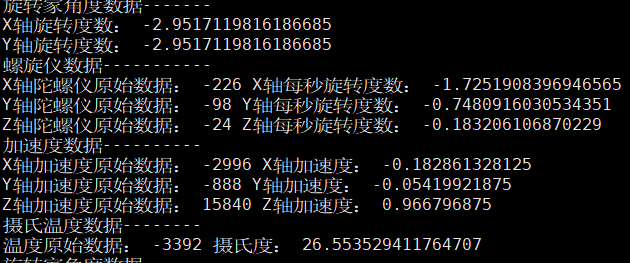

### 实现功能

分为两个模式：

​	**遥控模式**与**自动寻迹模式**

* 遥控功能

  * 采用的是电脑遥控，读取键盘上WASD对树莓派进项遥控，预先设定好PWM值以保证车速不会过快。

* 黑线寻迹功能

  * 初始化

    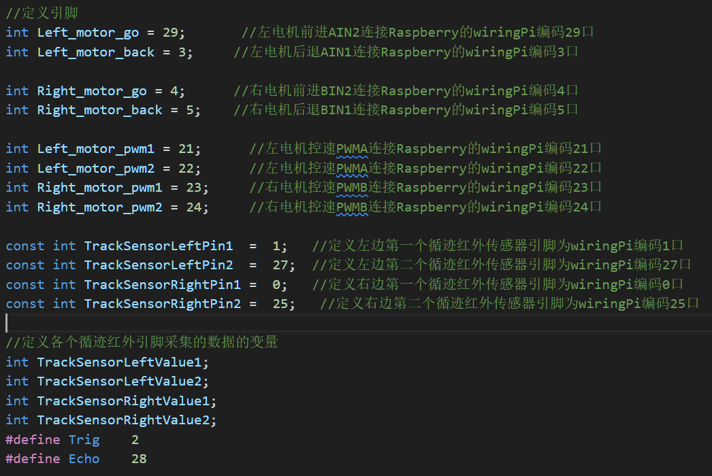

    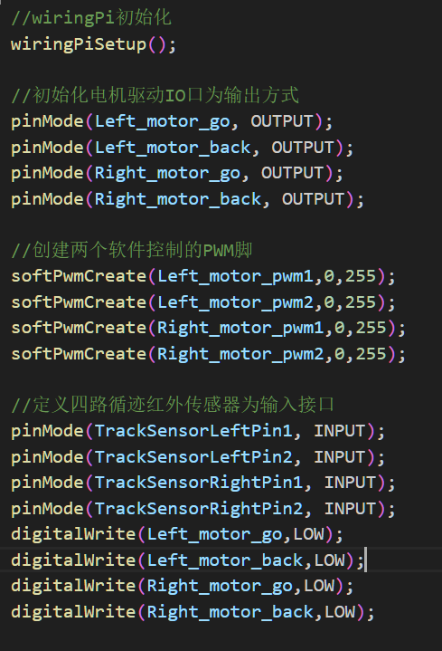

  * 采用四路寻迹
    * 中间两路用于定位黑线

    * 两侧两路用于调整方向

      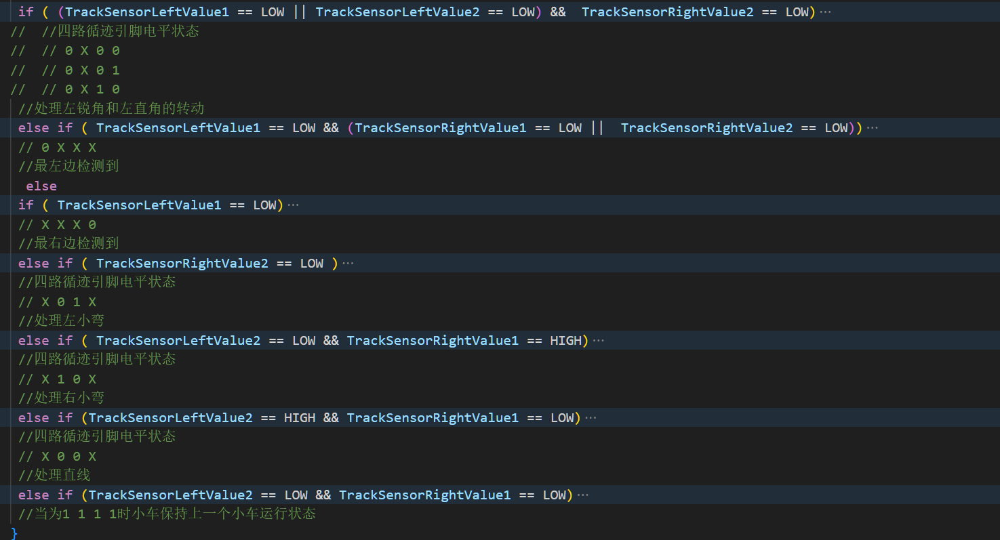

  * 黑线循迹设计了6种行驶函数

    * run()前进

      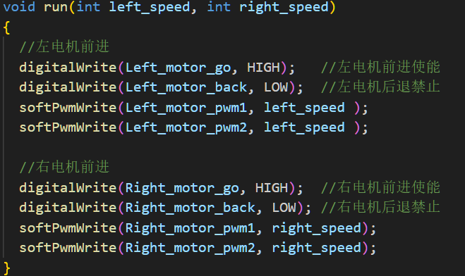

    * left()前进并左转

      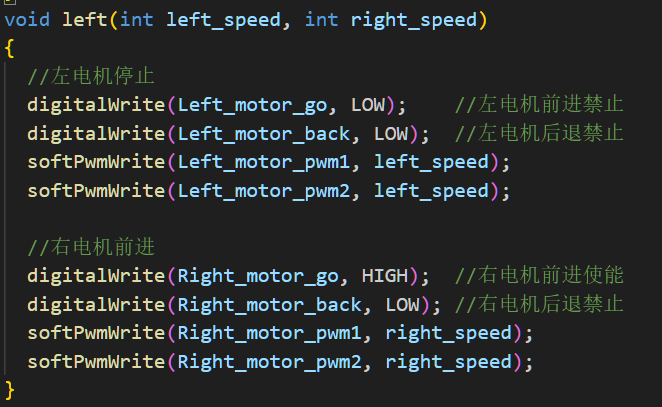

    * right()前进并右转

      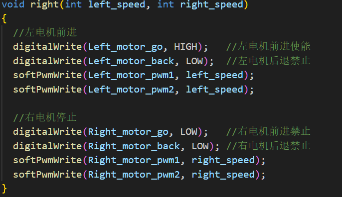

    * spin_left()原地左转

      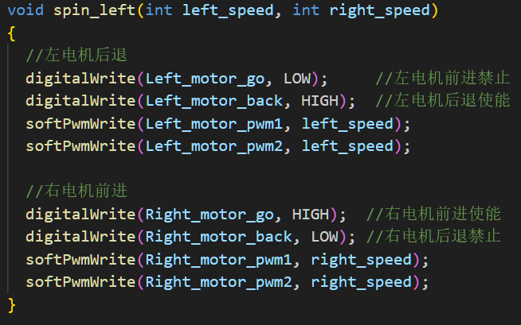

    * spin_right()原地右转

      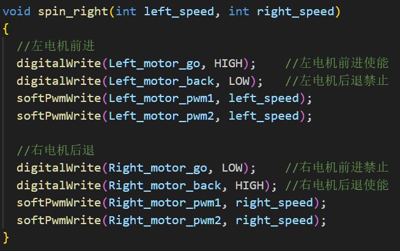

    * back()后退

      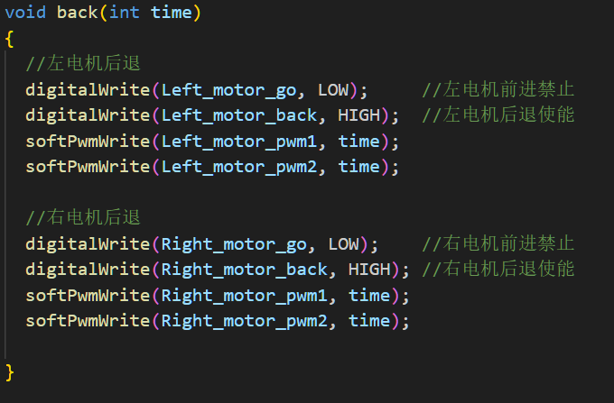

  * 其中每一个行驶函数都接收speed参数，用于pwm调速。

  * 【视频】

* 超声波避障

  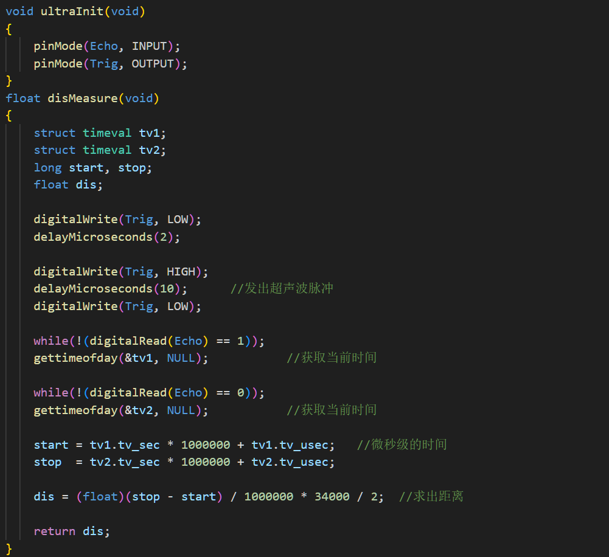

  * 测距功能：在遥控模式下，可以对当前距离进行测量。
  * 警告功能：在遥控模式下，在调用run()函数进行前进时候，如果距离测量为50cm，就停止前进，并通过蜂鸣器发出警告。
  * 【视频】

* 摄像头监视功能

  * 采用motion进行监视，实时录像8081口

  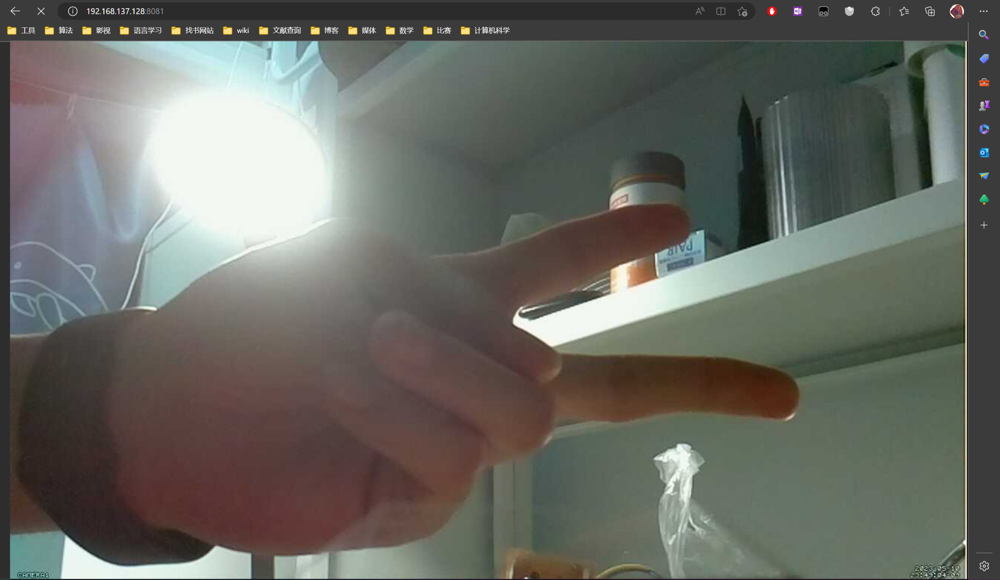  n 

* 服务器遥控

  * 给树莓派安装了anaconda 3，通过写一个php文件，建立一个服务端口。
  * 同一个WiFi下的设备可以访问树莓派IP进行操控。

  

* 加速度、旋转速度测量

  * 自动建图的数据基础
  * 【视频】

### 树莓派艺术

* 大声歌唱
  * 通过对无源蜂鸣器模块的调频，写了几首内置歌曲。
  
  * 初始化蜂鸣器
  
    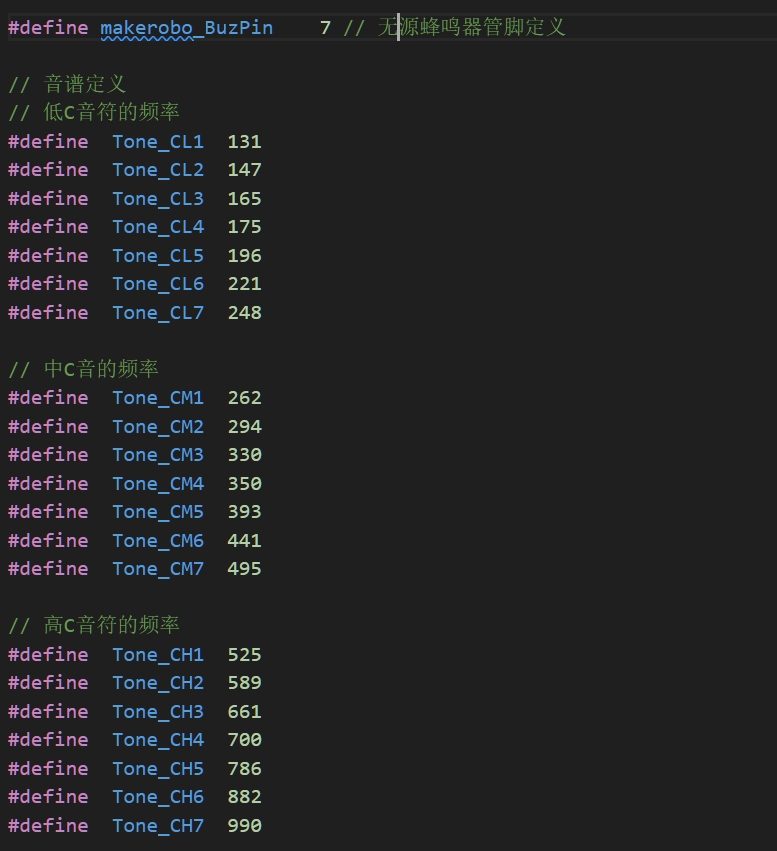
  
  * 编写歌曲
  
    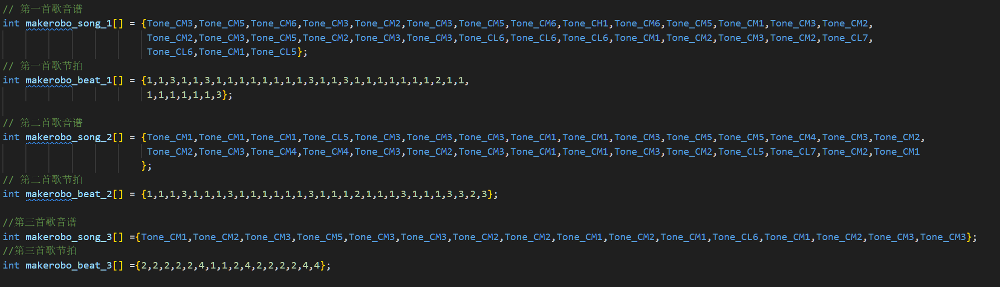
  
  * 【视频】
  
  
  
* 大力钻孔

  * 本次项目，体验了钻孔的艺术，由于原有的车体骨架打孔并不符合一些客制化需求，购置了新的亚克力板，并进行钻孔以进行组装。
  * 

  * 本车外貌仿人的模样
    * 超声波模拟眼睛
    * 蜂鸣器模拟嘴巴
    * 摄像头模拟天眼
    
    
    
  * 本车的现实意义
    
    
    
    * 这个项目受电赛的送药小车的启发，联想到过去三年的疫情。
    * 上面贴有“连花清瘟胶囊”与“新型冠状病毒测试试剂”
    * 口罩象征着我们共同经历过的疫情抗争
    * 内部有一张花切魔术牌，医疗人员有着魔术师般的魔力，拯救病人于危难，拯救这个破碎不堪的世界。
    * 内置歌曲《听我说谢谢你》，深深地表达对抗疫人员的赞美与致敬
